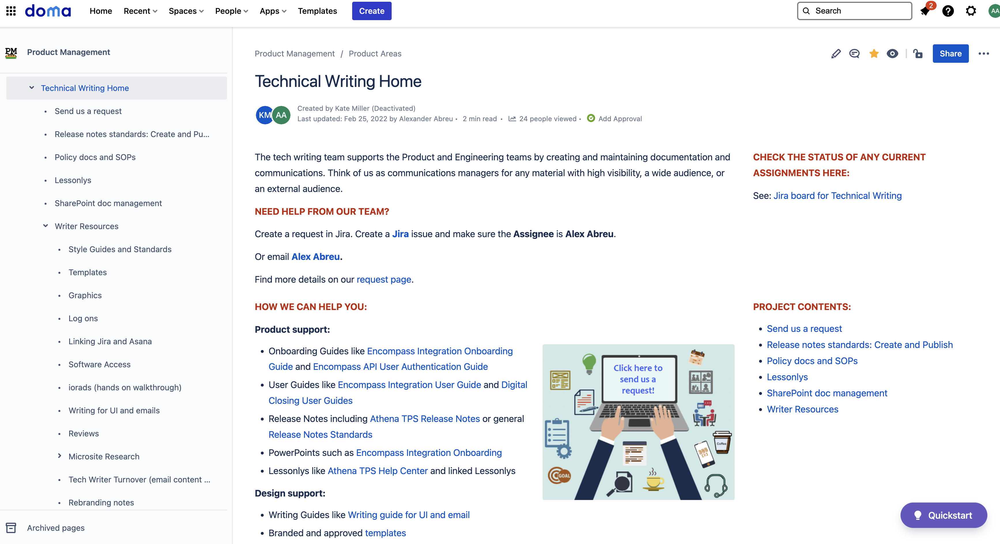

# What's here

Here is my portfolio (of sorts), a collection of samples and screenshots 
that I can share from past projects.

Of course all my latest work is Web, templates, and wiki content. 
But I've even included here some printed guides
and work that spans my entire career.

Interested in [viewing my resume](./resume.md)? 

Or [return to the home page](https://aeabreu.github.io/).

# Work samples

Click the images to view more.

## Web & wikis examples

## Diagram examples

## Manual & guide examples

